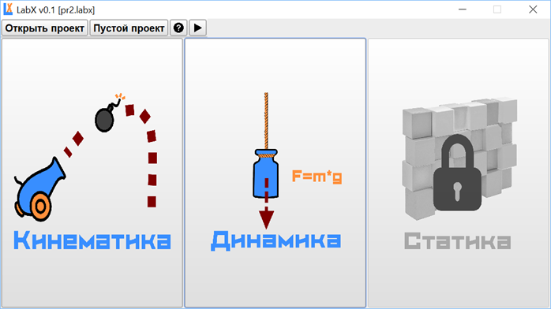

# LabX
Проект LabX создан для того, чтобы сделать обучение физике максимально интересным. Пользуясь данным продуктом, пользователь не только сможет детально разобрать базовые законы кинематики и динамики, но и научиться программировать. Среда обладает удобным пользовательским интерфейсом, что также способствует качественному обучению. 
 
 

