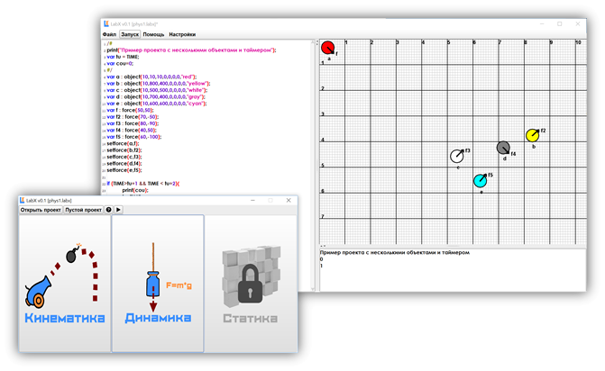
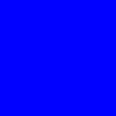
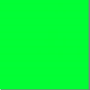
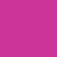
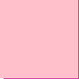
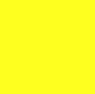
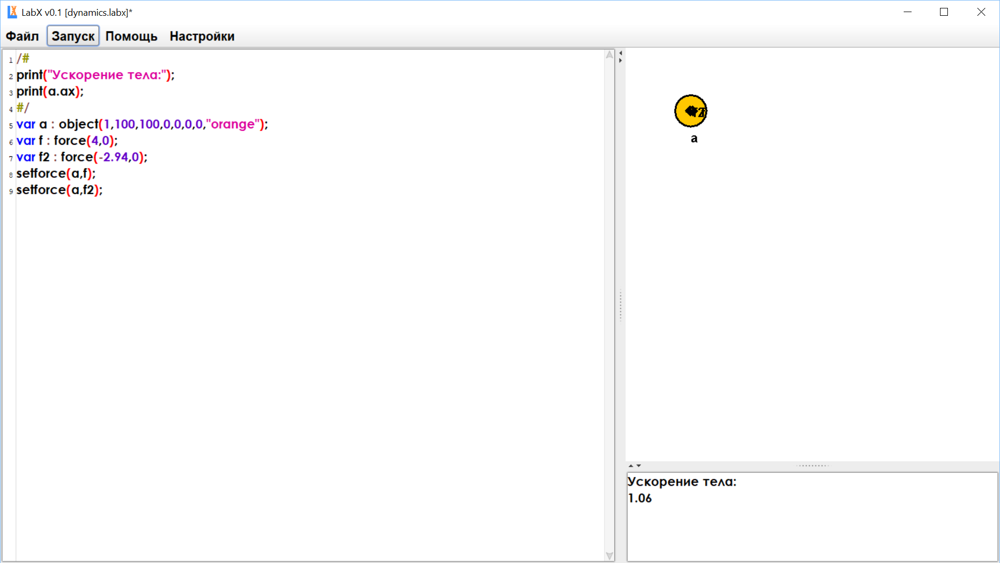
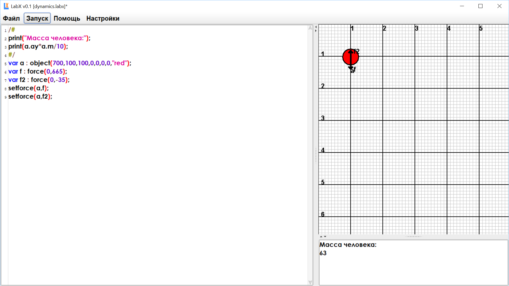

# LabX
Проект LabX создан для того, чтобы сделать обучение физике максимально интересным. Пользуясь данным продуктом, пользователь не только сможет детально разобрать базовые законы кинематики и динамики, но и научиться программировать. Среда обладает удобным пользовательским интерфейсом, что также способствует качественному обучению. 
 
 

# Программирование в среде LabX

Решение физических задач и описание физических процессов в среде LabX, реализуется на языке JavaScript.

Основные функции языка JavaScript:
<H3> 1.	Печать в консоль: </H3>
<pre class="javascript" style="font-family:monospace;"><ol><li style="font-weight: normal; vertical-align:top;">
print&#40;&#41;;  
</li></ol></pre>
<H3>2.	Создание переменных:</H3>
<pre class="javascript" style="font-family:monospace;"><ol><li style="font-weight: normal; vertical-align:top;">
var a = &quot;text&quot;;  
</li><li style="font-weight: normal; vertical-align:top;">
var b = 10;  
</li></ol></pre>
<em>На имя переменной в JavaScript наложены всего два ограничения.
Имя может состоять из: букв, цифр, символов $ и _
Первый символ не должен быть цифрой.
Так как JavaScript является слабо типизированным языком программирования, при создании переменных не нужно указывать их тип. Достаточно просто присвоить значение.</em>
<h3>3.	Условные операторы:</h3>
<pre class="javascript" style="font-family:monospace;"><ol><li style="font-weight: normal; vertical-align:top;">
if &#40;year &lt; 2018&#41; &#123;  
</li><li style="font-weight: normal; vertical-align:top;">
    print&#40; &quot;Это слишком рано..&quot; &#41;;  
</li><li style="font-weight: normal; vertical-align:top;">
&#125; else if &#40;year &gt; 2018&#41; &#123;  
</li><li style="font-weight: normal; vertical-align:top;">
    print&#40; &quot;Это поздновато..&quot; &#41;;  
</li><li style="font-weight: bold; vertical-align:top;">
&#125; else &#123;  
</li><li style="font-weight: normal; vertical-align:top;">
    print&#40; &quot;Да, точно в этом году!&quot; &#41;;  
</li><li style="font-weight: normal; vertical-align:top;">
&#125;  
</li></ol></pre> 

<h3>4.	Циклы</h3>
<em>Цикл while:</em>
<pre class="javascript" style="font-family:monospace;"><ol><li style="font-weight: normal; vertical-align:top;">
while &#40;условие&#41; &#123;  
</li><li style="font-weight: normal; vertical-align:top;">
  // код, тело цикла  
</li><li style="font-weight: normal; vertical-align:top;">
&#125;  
</li></ol></pre>
<em>Цикл for:</em>
<pre class="javascript" style="font-family:monospace;"><ol><li style="font-weight: normal; vertical-align:top;">
for &#40;начало; условие; шаг&#41; &#123;  
</li><li style="font-weight: normal; vertical-align:top;">
  // ... тело цикла ...  
</li><li style="font-weight: normal; vertical-align:top;">
&#125;  
</li><li style="font-weight: normal; vertical-align:top;">
&nbsp;
</li></ol></pre>

<pre class="javascript" style="font-family:monospace;"><ol><li style="font-weight: normal; vertical-align:top;">
var i;  
</li><li style="font-weight: normal; vertical-align:top;">
&nbsp;
</li><li style="font-weight: normal; vertical-align:top;">
for &#40;i = 0; i &lt; 3; i++&#41; &#123;  
</li><li style="font-weight: normal; vertical-align:top;">
  print&#40; i &#41;;  
</li><li style="font-weight: bold; vertical-align:top;">
&#125;  
</li></ol></pre>

Код проектов LabX исполняется в цикле.
<em>(соответственно если вызвать метод print(); в основном теле программы, текст будет печататься в консоль непрерывно)</em>

Для того чтобы задать константы для проекта или напечатать текст один раз в начале выполнения проекта,  в LabX предусмотрен специальный тип комментариев:

<pre class="javascript" style="font-family:monospace;"><ol><li style="font-weight: normal; vertical-align:top;">
/# 
</li><li style="font-weight: normal; vertical-align:top;">
print&#40;&quot;Начало выполнения программы&quot;&#41;;  
</li><li style="font-weight: normal; vertical-align:top;">
#/ 
</li></ol></pre>

<h3>Служебные константы и объекты системы LabX</h3>
<H4>1. Служебный объект Running:</H4>
Отвечает за цикл симуляции физики.
<em>Функции и методы:</em>
<pre class="javascript" style="font-family:monospace;"><ol><li style="font-weight: normal; vertical-align:top;">
Running.set&#40;false&#41;;  
</li></ol></pre>
Завершает симуляцию физики.
<pre class="javascript" style="font-family:monospace;"><ol><li style="font-weight: normal; vertical-align:top;">
Running.get&#40;&#41;;  
</li></ol></pre>
Возвращает состояние цикла симуляции.
<H4>2.	Служебная переменная TIME</H4>
В данной переменной хранится текущее время (в секундах) с начала работы программы.

# Создание физических объектов

В языке программирования LabX предусмотрена возможность создания специальных шарообразных объектов, со следующими атрибутами:
<ul>
 <li>масса</li>
 <li>координаты</li>
 <li>проекции скорости и ускорения на оси координат</li>
 <li>цвет</li>
</ul>

Соответственно:
<ul>
<li><em>m</em> - масса объекта</li>
<li><em>x</em> - координата x объекта</li>
<li><em>y</em> - координата y объекта</li>
<li><em>vx</em> - проекция скорости объекта на ось x</li>
<li><em>vy</em> - проекция скорости объекта на ось y</li>
<li><em>ax</em> - проекция ускорения на ось x</li>
<li><em>ay</em> - проекция ускорения на ось y</li>
</ul>
<em>Таблица воможных цветов объекта:</em>
<table>
 <tr>
  <td><b>Название</b></td>
  <td><b>Расшифровка</b></td>
  <td><b>Цвет</b></td>
  </tr>
  <tr>
    <td>“black”</td>
   <td>Черный</td>
   <td>
    
   </td>
  </tr>
  <tr>
    <td>“blue”</td>
   <td>Синий</td>
   <td>
    
   </td>
  </tr>
  <tr>
    <td>“cyank”</td>
   <td>Циан 
(сине-зелёный)
</td>
   <td>
    
   </td>
  </tr>
  <tr>
    <td>“black”</td>
   <td>Черный</td>
   <td>
    
   </td>
  </tr>
  <tr>
    <td>“darkgray”</td>
   <td>Тёмно-серый</td>
   <td>
    
   </td>
  </tr>
  <tr>
    <td>“gray”</td>
   <td>Серый</td>
   <td>
    
   </td>
  </tr>
  <tr>
    <td>“lightgray”</td>
   <td>Светло-серый</td>
   <td>
    
   </td>
  </tr>
 <tr>
    <td>“green”</td>
   <td>Зелёный</td>
   <td>
    
   </td>
  </tr>
  <tr>
    <td>“magenta”</td>
   <td>Маджента
(малиновый)
</td>
   <td>
    
   </td>
  </tr>
 <tr>
    <td>“orange”</td>
   <td>Оранжевый</td>
   <td>
    
   </td>
  </tr>
  <tr>
    <td>“pink”</td>
   <td>Розовый</td>
   <td>
    
   </td>
  </tr>
 <tr>
    <td>“red”</td>
   <td>Красный</td>
   <td>
    
   </td>
  </tr>
  <tr>
    <td>“yellow”</td>
   <td>Жёлтый</td>
   <td>
    
   </td>
  </tr>
</table>

Пример создания объекта красного цвета, c массой 5 кг, находящийся в координатах (200,300), с проекциями скорости на оси координат (10, 10) и проекциями ускорения (2, 2).

<pre class="javascript" style="font-family:monospace;"><ol><li style="font-weight: normal; vertical-align:top;">
var ob1 : object&#40;5,200,300,10,10,2,2,”red”&#41;; 
</li></ol></pre>

Обращение к атрибутам созданных физических объектов:

<pre class="javascript" style="font-family:monospace;"><ol><li style="font-weight: normal; vertical-align:top;">
ob1.x=100;  
</li></ol></pre>

# Процедуры создания физических сил

Физические силы – это силы, действующие на созданные учеником объекты. Они приводят объект в движение, придают ему скорость.
После нажатия кнопки “Запуск“ все объекты, на которые действуют силы, приводятся в движение.
На один объект одновременно может действовать несколько сил.

Структура создания силы выглядит следующим образом:
<pre class="javascript" style="font-family:monospace;"><ol><li style="font-weight: normal; vertical-align:top;">
var &lt;название силы&gt; : force&#40;fx,fy&#41;;  
</li></ol></pre>

Для того чтобы определить силу для объекта, нужно воспользоваться следующей процедурой:

<pre class="javascript" style="font-family:monospace;"><ol><li style="font-weight: normal; vertical-align:top;">
var &lt;название силы&gt; : force&#40;fx,fy&#41;;  
</li></ol></pre>

Пример создания физической силы:

<pre class="javascript" style="font-family:monospace;"><ol><li style="font-weight: normal; vertical-align:top;">
var f : force&#40;20,40&#41;;  
</li></ol></pre>

Обращение к атрибутам созданных физических сил:

<pre class="javascript" style="font-family:monospace;"><ol><li style="font-weight: normal; vertical-align:top;">
f.fx=10;
</li></ol></pre>

# Методические указания

Здесь будут представлены основные способы применения LabX на уроках в школах. Также здесь будут приведены примеры программ и упражнений, которые можно использовать на уроках.
На уроках физики LabX предлагается использовать во время изучения Механики и Динамики. Объекты и силы позволяют демонстрировать характер движения тел.
Рекомендуется применять LabX в решении задач на нахождение равнодействующей нескольким силам. А также для оценки пройденного телом расстояния.

# Решение задач

1.	На горизонтальной крышке стола лежит учебник массой m = 1 кг. В некоторый момент на него начинает действовать сила F, модуль которой равен 2 Н. В результате учебник начинает двигаться поступательно. Определите ускорение учебника, если коэффициент трения μ, между ним и поверхностью стола равен 0,3?

<pre class="javascript" style="font-family:monospace;"><ol><li style="font-weight: normal; vertical-align:top;">
/#   
</li><li style="font-weight: normal; vertical-align:top;">
print&#40;&quot;Ускорение тела:&quot;&#41;;  
</li><li style="font-weight: normal; vertical-align:top;">
print&#40;a.ax&#41;;  
</li><li style="font-weight: normal; vertical-align:top;">
#/  
</li><li style="font-weight: bold; vertical-align:top;">
var a : object&#40;1,100,100,0,0,0,0,&quot;orange&quot;&#41;;  
</li><li style="font-weight: normal; vertical-align:top;">
var f : force&#40;4,0&#41;;  
</li><li style="font-weight: normal; vertical-align:top;">
var f2 : force&#40;-2.94,0&#41;;  
</li><li style="font-weight: normal; vertical-align:top;">
setforce&#40;a,f&#41;;  
</li><li style="font-weight: normal; vertical-align:top;">
setforce&#40;a,f2&#41;;  
</li></ol></pre>

Ответ: ускорение a = 1.06 m/c2

2.	Человек массой 70 кг стоит на напольных пружинных весах в лифте. Лифт начинает двигаться с ускорением 0,5 м/с2, направленным вниз. В этот момент весы покажут массу.
(Источник: МИОО: Тренировочная работа по физике 16.05.2014 вариант ФИ90702.)
 
1) 70 кг
2) больше 70 кг
3) меньше 70 кг
4) 0

<b>Решение.</b>
Движущийся с ускорением лифт — неинерциальная система отсчёта, следовательно, на человека в лифте помимо силы тяжести будет действовать сила инерции, направленная противоположно ускорению лифта, то есть вверх, значит, весы покажут массу менее 70 кг.

Правильный ответ указан под номером 3.

<b>Решение задачи на LabX:</b>

<pre class="javascript" style="font-family:monospace;"><ol><li style="font-weight: normal; vertical-align:top;">
/#  
</li><li style="font-weight: normal; vertical-align:top;">
print&#40;&quot;Масса человека:&quot;&#41;;  
</li><li style="font-weight: normal; vertical-align:top;">
print&#40;a.ay*a.m/10&#41;;  
</li><li style="font-weight: normal; vertical-align:top;">
#/  
</li><li style="font-weight: bold; vertical-align:top;">
var a : object&#40;700,100,100,0,0,0,0,&quot;red&quot;&#41;;  
</li><li style="font-weight: normal; vertical-align:top;">
var f : force&#40;0,665&#41;;  
</li><li style="font-weight: normal; vertical-align:top;">
var f2 : force&#40;0,-35&#41;;  
</li><li style="font-weight: normal; vertical-align:top;">
setforce&#40;a,f&#41;;  
</li><li style="font-weight: normal; vertical-align:top;">
setforce&#40;a,f2&#41;; 
</li></ol></pre>

